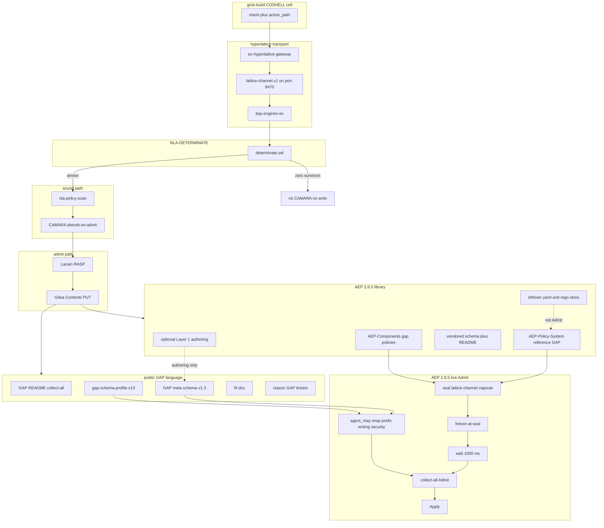

# GAP 2.8.5 operational remediation implementation plan

@PAD: gap-285-operational-remediation-v1
@GCDE: gaplune.plan.v1

The governed human twin of this operational remediation plan lives on thePM001/NLA-PLATFORM under Platform-Development/specs and a public copy lives on thePM001/GAP under docs. Status is OPERATOR-ORDERED-BUILD under Biosecure UNVACCINATED Supreme User authority with agent grok-build while crate build waits for PLAN-APPROVED-BY-BIOSECURE-SUPREME-USER and this deposit is plan authoring plus ticket authoring only without a LIVE claim or a coding-close claim. Language-contract children already exist and the remaining operational holes are the work below.

Policies on this plan are nla-server-plan-dev-tickets-mandatory.gap, nla-server-plan-architecture-diagram-mandatory.gap, nla-server-plan-hyperlattice-compliance-mandatory.gap, nla-server-gap-plans-mandatory.gap, nla-server-writing-mode-rules.gap and nla-server-english-only-policy.gap. Fscale contract, fleet SSOT and the invention harness gate live on thePM001/NLA-PLATFORM at harness/FSCALE-AGENT-CONTRACT.txt, registry/fleet-infrastructure-manifest.yaml and harness/gate-invention-plan-mandatory.sh with full Gitea URLs http://100.118.184.18:3003/thePM001/NLA-PLATFORM/src/branch/main/harness/FSCALE-AGENT-CONTRACT.txt , http://100.118.184.18:3003/thePM001/NLA-PLATFORM/src/branch/main/registry/fleet-infrastructure-manifest.yaml and http://100.118.184.18:3003/thePM001/NLA-PLATFORM/src/branch/main/harness/gate-invention-plan-mandatory.sh.

## Plan approval gate (mandatory)

Approval tag required before crate build is PLAN-APPROVED-BY-BIOSECURE-SUPREME-USER with current state pending that same tag under policy nla-server-invention-plan-before-build because the operator ordered a remediation plan document plus dev tickets and crate build is not ordered until the approval tag is present.

### Supreme User approval line

pending PLAN-APPROVED-BY-BIOSECURE-SUPREME-USER

### Operator approval line

OPERATOR-ORDERED-BUILD

## Verdict

Classic GAP on thePM001/GAP now teaches collect-all Admit, freeze-at-seal, 1000 ms kernel pulse and agent_may while schema v1.3 allows agent_may, wrap, action_path_prefix and pattern.guard while the schema-profile crate Denies any non-empty trust_ring, yet that is not complete operational match with AEP 2.8.5 because live AEP 2.8.5 still loads AEP-Policy-System/reference GAP files and AEP-Components/gap/policies/reference GAP files that still set trust_ring and have zero agent_may while several still claim AEP 2.75 provenance. The vendored AEP-Components/gap README still teaches trust rings and omits sha256-structure, leftover yaml and rego files sit beside live GAP and can be mistaken for Admit skins, Layer 1 text still over-claims and the fit doc still reads as a language gap rather than remaining operational work. One law is that live documents must not set trust_ring, schema text must not call that field unused at Admit and the crate keeps Deny on any non-empty trust_ring.

## Hard locks

Product names stay GAP, AEP 2.8.5 and nla-policy-scan with no third brand. Classic GAP stays .gap and this plan does not rename public GAP files to .gaplune or dump GAPLUNE trees into public GAP. Hangar tickets for this plan are .gaplune under NLA-DEV-TICKETS and classic twins are .gap under GAP docs/dev-tickets. Do not mint a board-named ticket file. Ticket status is backlog, in_progress, blocked, closed or cancelled and status open is Deny. trust_ring is not a live Admit floor and presence closes gap:trust_ring:rank. Who-may is agent_may and empty grants DENY on miss when an agent action is judged. Writing and security are always-on stems and other walls bind wrap or action_path_prefix. Skip is not a live verb and fifteen named rows are a derived ledger. Live EPSCOM trust bundle is sha256-structure. Kernel policies may be JSON-encoded GAP objects and YAML remains valid GAP source. Closed-wall Deny names ids, reasons and prescribed repair then retry reseals. Gitea thePM001 is the only code write surface. English only, ASCII hyphen and no Oxford comma. Product Python banned unless a later supreme approval names it. Do not distill full AEP 3.0 CAW. Creation generate is not used on this plan. Agents use nla-lattice-api-route with no direct engine dial as the governed pattern.

## Total architecture diagram

This diagram is the total architecture for GAP plus AEP 2.8.5 live Admit after remediation and it is not a UI wireframe.

## One-law freeze for trust_ring

Live GAP documents must not set trust_ring. Schema v1.3 description must not call trust_ring unused at Admit. gap-schema-profile-v13 keeps Deny on any non-empty trust_ring. AEP vendored schema must match that same law. Who-may is agent_may with empty grants DENY on miss. wrap plus action_path_prefix bind walls that are not always-on. Presence is a closed wall named gap:trust_ring:rank.

## Remaining defects

GAP schema v1.3 still describes trust_ring in a way that can be read as unused at Admit while the crate Denies any non-empty value at http://100.118.184.18:3003/thePM001/GAP/src/branch/main/GAP%20meta%20schema%20v1.3.json and http://100.118.184.18:3003/thePM001/GAP/src/branch/main/crate. AEP vendored schema is still v1 plus v1.2 at http://100.118.184.18:3003/thePM001/NLA-AEP-v2.8-open-source/src/branch/main/AEP-Components/gap/schemas. AEP-Policy-System/reference writing.gap, security.gap, governance.gap, deployment.gap, network-egress-no-smtp.gap, hipaa.gap, gdpr.gap, eu-ai-act.gap, iso-42001.gap, nist-ai-rmf.gap and soc2-type2.gap still set trust_ring and have zero agent_may at http://100.118.184.18:3003/thePM001/NLA-AEP-v2.8-open-source/src/branch/main/AEP-Policy-System/reference. AEP-Components/gap/policies/reference CAW profiles and coding-governance docs still set trust_ring at http://100.118.184.18:3003/thePM001/NLA-AEP-v2.8-open-source/src/branch/main/AEP-Components/gap/policies/reference. Vendored README still teaches trust rings and omits sha256-structure at http://100.118.184.18:3003/thePM001/NLA-AEP-v2.8-open-source/src/branch/main/AEP-Components/gap/README.md. Leftover yaml and rego files sit beside live GAP at http://100.118.184.18:3003/thePM001/NLA-AEP-v2.8-open-source/src/branch/main/AEP-Policy-System. Layer 1 text claims a live constrained engine at the same README plus lib/gap-constrained-engine.mjs. The fit doc still frames language-contract work as the remaining gap at http://100.118.184.18:3003/thePM001/GAP/src/branch/main/docs/CLASSIC-GAP-VS-AEP-2.8.5.md.

## Dev tickets

The opening of this plan is the connected paragraph above. Each product ticket follows as one paragraph.

GAP-285-P8 (priority P0) is at http://100.118.184.18:3003/thePM001/GAP/src/branch/main/docs/dev-tickets/GAP-285-P8.gap with commit f9a712cbfe8630f988c6df304888a96a2418e437. Schema v1.3 still describes trust_ring as unused at Admit while the crate Denies any non-empty value so vendor schema and live docs disagree.

GAP-285-P6 (priority P0) is at http://100.118.184.18:3003/thePM001/GAP/src/branch/main/docs/dev-tickets/GAP-285-P6.gap with commit 36e0609d156fe3596889a4823be4c595fd96a730. AEP-Policy-System reference GAP files still set trust_ring and have zero agent_may so collect-all Admit cannot load a 2.8.5 who-may profile.

GAP-285-P7 (priority P0) is at http://100.118.184.18:3003/thePM001/GAP/src/branch/main/docs/dev-tickets/GAP-285-P7.gap with commit 7c4545a08dbef06aa4dd6c54dfb482c77f7e819e. CAW and coding-governance reference GAP still set trust_ring so the vendored instruction set is not the live 2.8.5 profile.

GAP-285-P9 (priority P1) is at http://100.118.184.18:3003/thePM001/GAP/src/branch/main/docs/dev-tickets/GAP-285-P9.gap with commit 350e95519a0bec1ffd39aeae26858203dba4a7e3. Vendored AEP-Components gap README still teaches trust rings and omits sha256-structure so operators cannot see the live trust bundle.

GAP-285-P10 (priority P1) is at http://100.118.184.18:3003/thePM001/GAP/src/branch/main/docs/dev-tickets/GAP-285-P10.gap with commit f712992ee2abfcc59f21c82168a5d17f71256c9e. Leftover yaml and rego files sit beside live GAP and can be mistaken for collect-all Admit skins.

GAP-285-P11 (priority P1) is at http://100.118.184.18:3003/thePM001/GAP/src/branch/main/docs/dev-tickets/GAP-285-P11.gap with commit a6495de2e65a5bdb70bf9463fe219c13ad9b2aac. Layer 1 text still claims a live constrained engine so Admit is confused with optional authoring.

GAP-285-P12 (priority P1) is at http://100.118.184.18:3003/thePM001/GAP/src/branch/main/docs/dev-tickets/GAP-285-P12.gap with commit 3edaa1016b88b97fc12a7460b5f6222e457355a6. The fit doc still frames language-contract work as the remaining gap so operators cannot see operational holes.

Phase A is one-law plus fit rewrite, phase B rewrites live AEP-Policy-System reference and CAW reference, phase C refreshes vendor README and names leftover yaml, phase D tells Layer 1 honesty and phase E is operator close after Gitea bytes plus gates, with one-law first, reference rewrites waiting on one-law, vendor README waiting on the reference rewrites and leftover yaml waiting on the AEP-Policy-System rewrite.

Classic GAP tickets live under http://100.118.184.18:3003/thePM001/GAP/src/branch/main/docs/dev-tickets and hangar tickets live under http://100.118.184.18:3003/thePM001/NLA-PLATFORM/src/branch/main/NLA-DEV-TICKETS/tickets. Do not convert classic GAP tickets to .gaplune. Do not edit GAPLUNE language trees for this plan.

## Infrastructure compliance

Fleet SSOT is http://100.118.184.18:3003/thePM001/NLA-PLATFORM/src/branch/main/registry/fleet-infrastructure-manifest.yaml. This plan is EX hangar governance work on public GAP and the AEP 2.8.5 library and it is not an FX UI.

| Component | Role in this plan |
| --- | --- |
| bay-engines-ex | Hosts lattice-channel, Lacain, CAMARA, DETERMINATE |
| bay-platform-fx | No engine listeners. No UI in this plan |
| bay-export-gx | Out of scope |
| EX hyperlattice gateway | Mandatory lattice-channel on port 8470. No direct engine dial |
| lacain-fabric | Health only |
| grok-build COSHELL cell | Sole agent that may edit |
| Gitea thePM001/NLA-PLATFORM | Plan, hangar tickets, ticket index, policy |
| Gitea thePM001/GAP | Public GAP schema, crate, classic tickets, fit doc |
| Gitea thePM001/NLA-AEP-v2.8-open-source | Reference GAP, CAW profiles, vendor README, leftover skins |
| TUI | DS.4.coshell-engine |
| nla-policy-scan FS.0.128.172 | Sole gate authority |
| nla-lattice-api-route FS.0.128.22 | Sole lattice-request client |
| nla-gitea-put-file FS.0.128.243 | Sole deposit tool |
| Creation generate | Not used |

SQLite is not a store for this plan. No new tool uses SQLite as primary.

## Hyperlattice transport

Governed lattice requests use nla-lattice-api-route over lattice-channel.v1 on port 8470 in bay-engines-ex with Sel channel determinate.sel, CAMARA channel absorb-on-admit, Transform encode on the existing Transform cell and COSHELL tool.proxy when mounted, while blocked paths are direct curl to Lacain runtime, Transform engine ports, CAMARA and Enhanced Base Node except via gateway.

## Mandatory build toolchain

Every coding ACTION on this plan after approval starts with lacain-fscale resolve of the named tool, then Transform encode, then Dscale recognize and Escale effort, then determinate.sel with speculate true and spec_tree true, then CAMARA absorb-on-admit of the winner, then Lacain RASP route, then edit only the files named in the ticket, then crate tests on gap-schema-profile-v13 when the crate changes, then nla-policy-scan gate writing-mode-rules on changed GAP and md files, then Gitea Contents deposit with printed commit sha. Agent is grok-build and not composer-caw. This authoring lattice step deposits the plan and tickets only and it does not claim coding-close.

## Biosecurity toolchain

Biosecure UNVACCINATED Supreme User directive. Features must be implemented with absolute correctness and no half-fix. Build must compile and run without errors before Gitea deposit of code. Verify end-to-end that live GAP with trust_ring is Deny, live GAP with agent_may can Admit, reference files have zero trust_ring, leftover yaml is not Admit and Layer 1 is authoring only. Register new or modified components in AEP. Product Python banned unless a later supreme approval names it. Writing stays English only with ASCII hyphen.

## GAPLUNE task manifest (ROUTE)

ROUTE lattice-channel.v1 is the GAPLUNE task manifest for agent grok-build. Plan stem is the file name of this document. Scale order is Fscale, Dscale, Escale, Transform, determinate.sel, CAMARA and RASP with gateway ex-hyperlattice-gateway, bay bay-engines-ex, TUI DS.4.coshell-engine and lattice_channel lattice-channel.v1.

## Gates summary

| When | Gate |
| --- | --- |
| Plan authoring | gate-plan-architecture-diagram.sh gate-plan-dev-tickets-mandatory.sh gate-plan-hyperlattice-compliance.sh gate-invention-plan-mandatory.sh gate-no-personal-name-gitea.sh |
| Each stage exit | nla-policy-scan gate writing-mode-rules on changed GAP and md files. crate tests when crate changes |
| User-facing text | nla-policy-scan deliver |
| Coding-close | quality-stack plus gitea-write-proof plus coding-completion. Operator must order close. |

## Fscale cells for this plan

| Alias | Id |
| --- | --- |
| nla-lattice-api-route | FS.0.128.22 |
| determinate.sel | FS.0.128.109 |
| camara | FS.0.128.48 |
| nla-policy-scan | FS.0.128.172 |
| Transform encode | FS.0.0.54 |
| lacain.dscale.recognize | FS.0.0.21 |
| lacain.escale.effort | FS.0.0.24 |
| lacain.rasp.route | FS.0.0.76 |
| nla-harness | FS.0.128.115 |
| brain.search | FS.0.128.163 |
| nla-gitea-put-file | FS.0.128.243 |

Unknown alias after retry is HARD DENY.

## Out of this plan

This plan does not add a second kernel beside AEP 2.8.5 collect-all Admit, does not distill full AEP 3.0 CAW, does not dump GAPLUNE into public GAP, does not mint a board-named ticket file, does not put trust_ring on live Admit, does not use skip as a live verb, does not reopen closed language-contract children, does not claim complete operational match before the tickets above close and does not use Creation generate for a new crate brand.

## Close condition (operator-facing, after approval and build)

Operational match exists when live GAP documents do not set trust_ring, schema v1.3 and the vendor schema describe presence as Deny, gap-schema-profile-v13 still Denies any non-empty trust_ring, AEP-Policy-System/reference GAP files have agent_may and zero trust_ring, AEP-Components/gap/policies/reference files match that profile, vendored README names collect-all and sha256-structure, leftover yaml and rego are named as not Admit, Layer 1 is optional authoring, the fit doc tells remaining work then post-close truth and the operator orders coding-close while agents do not self-close.
