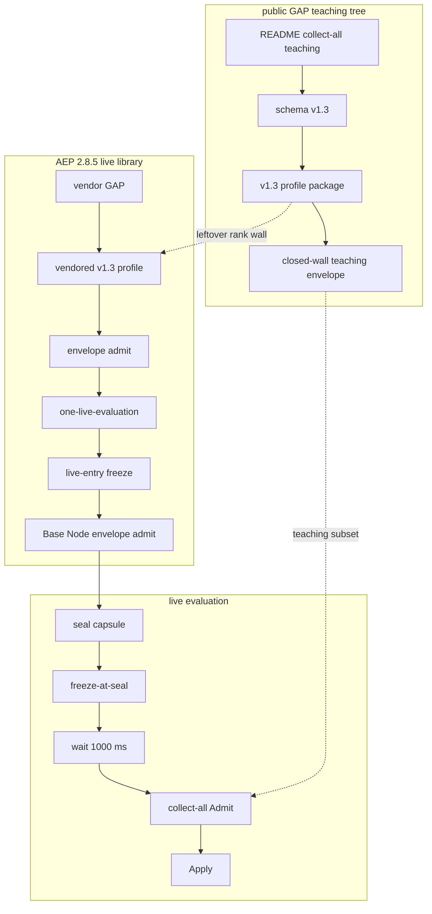

# GAP open source versus AEP 2.8.5 instructions and the simultaneous validation envelope

Public GAP already teaches the live AEP 2.8.5 evaluation story. An instruction is the atomic unit. Agents, workflows, validators, compositions and governance rules are all instructions that generate further instructions. A lattice-channel capsule is sealed, the clock freezes at seal, the kernel waits 1000 ms, every applicable check runs together and the allowed action is Applied only after Admit. Presence of trust_ring is Deny. Walls that are not always-on bind wrap or prefix. enabled is a load-time flag and a disabled instruction is still loaded and still judged. Layer 1 constrained decoding stays optional authoring and is not Admit. YAML 1.2 source remains valid GAP and the kernel reads the instruction object rather than the skin.

That teaching is real yet it is not a complete operational match with the live AEP 2.8.5 envelope. Live AEP 2.8.5 names agent permission as agent_permission, names leftover rank wall id gap:leftover_rank_field and runs one envelope combinator on Base Node docks. Public GAP names agent_permission and still names leftover rank wall id gap:trust_ring:rank. Its teaching envelope is a small subset of the live action-and-snapshot machine. Capsule digest in the closed-wall package is not sha256-structure. The fit document at https://github.com/thePM001/GAP/blob/main/docs/CLASSIC-GAP-VS-AEP-2.8.5.md says no holes remain in this set and that claim is too strong.

## Trees compared

Public GAP is the Apache-2.0 language snapshot on https://github.com/thePM001/GAP . It holds schema v1, v1.2 and v1.3, the README and two packages under packages. Last movement on that snapshot is 2026-09-06. It is not the hangar language tree.

AEP 2.8.5 is the public protocol library on https://github.com/thePM001/AEP-agent-element-protocol . It holds Base Node envelope admit, the envelope combinator, one-live-evaluation, live-entry freeze, the policy-system admit loader and the vendor GAP tree. Movement on that library is 2026-09-12. Product names stay GAP and AEP 2.8.5.

## Instructions: what now matches

Live evaluation teaching on public GAP matches live AEP 2.8.5 on the evaluation story itself. After the wait the client collects by capsule hash. Live trust bundle mode is sha256-structure. Presence of rank is Deny. Skip is not a live verb. Writing and security are always-on stems. Other GAP walls bind wrap or action_path_prefix. A closed-wall close names closed walls, reasons and a prescribed repair. A retry must seal a new capsule. Fifteen named rows are a derived ledger rather than a live sequential combinator. Keep `.gap` as GAP source. Live kernel policies may be JSON-encoded GAP objects. One instruction per document and multi-instruction families use YAML multi-document separators.

Instruction object shape matches on the shared fields address, pattern, action, weight, composition, metadata, wrap, action_path_prefix, covenants, scanners, budget, proof, fleet, knowledge, tools, aspect and pattern.guard as a string or a structured object. The public profile package compiles leftover rank presence, agent_permission grants, wrap or prefix bind and pattern.guard together. The closed-wall package compiles unbound scene, dock, timestamp, sequence and writing together, still evaluates when enabled is false, does not let attractors omit Admit and keeps grant lists off repair text. That is the public GAP instruction contract for collect-all.

## Instructions: what drifted after the last language-contract close

Live AEP 2.8.5 vendor GAP and the kernel envelope now say agent permission is agent_permission. The live action object has no rank field. Closed leftover rank wall id is gap:leftover_rank_field. The vendored profile package on the AEP 2.8.5 library reads metadata.agent_permission.

Public GAP names agent_permission. Schema v1.3 on https://github.com/thePM001/GAP defines metadata.agent_permission. The public profile package wall id is gap:agent_permission and leftover rank wall id is still gap:trust_ring:rank.

A live AEP 2.8.5 instruction object that is legal on the vendor tree is therefore not the object the public GAP profile package compiles because leftover rank wall id still does not match the live leftover rank field. AEP 2.8.5 still has its own doc lag because CHANGELOG and the top library README still write agent_may in places and vendor GAP README, schema v1.3 and the envelope already write agent_permission. Public GAP now tracks the live kernel permission field.

Other instruction holes on the public snapshot are package license files that say UNLICENSED and the repository LICENSE is Apache-2.0, a closed-wall capsule digest that is FNV-1a and teaching says sha256-structure, the over-strong fit document named above and an AEP Base Node registry component named gap that still lists only meta-schema v1 and v1.2.

## Simultaneous validation envelope

Live AEP 2.8.5 names one envelope combinator. Evaluation is pure and Apply mutates snapshot state after Admit and there is not a second sequential combinator beside that one meet. The sealed action carries action_path, agent_id, payload, tool, dest_dock, scene_id, agent_ts_ms, sequence_number and anomaly_score. The frozen seal snapshot carries lattice nodes, satisfied actions, pulse drift 50 ms, pulse age 5000 ms, docks, rate, tools and scanners. The combinator is the order-independent wall meet: AND of every closed wall and extra dock walls keep the same wall id. One-live-evaluation attaches live walls then processes the event and a second collect-all helper is not a second combinator. Base Node admits sealed plaintext on a live dock, Denies empty action_path before Apply, Denies non JSON and Denies a missing lattice. Live-entry freezes the temporal snapshot at seal and a 1000 ms hold still meets 50 ms drift and dest_dock may bind from the opened frame docking port. Envelope walls compile lattice-policy walls into the same collect-all pass. Policy-system admit loads policy-system GAP files as live walls bound to wrap or prefix and compiles leftover rank and agent_permission from the instruction object.

Live envelope walls judged together include dag.membership, gap.agent_permission, gap.writing, scene.membership, time, channel, rate, scanner, restricted policy, covenant, causal, forecast, parents, forbidden sequence and output ceiling. Row order does not change yes or no. If two walls fail both are listed.

The public GAP teaching envelope is AdmitEnvelope in the closed-wall package with scene, dock, timestamp, sequence, writing and enabled. live_admit compiles those five walls then collect_all and the teaching package is simultaneous in the collect-all sense and it is still not the live action-and-snapshot machine.

Missing on the public teaching envelope versus live AEP 2.8.5 envelope are action_path required before Apply, lattice node membership and parent closure, agent_permission on the lattice node and on the instruction, dest_dock bind from the opened frame, freeze-at-seal clock with 50 ms drift and 1000 ms pulse hold, Apply plan after Admit with no mutation on Deny, extra dock walls folded into one AND, sha256-structure capsule digest, output ceiling on simultaneous outputs and scanner plus covenant walls from instruction payload. The public README already teaches those live rules in prose and the packages do not yet run them.

## Total architecture diagram

This diagram is the total architecture for public GAP instructions and the live AEP 2.8.5 envelope. It is not a UI wireframe.

## One-law freeze for the public tree

Live GAP documents must not set trust_ring. Live GAP documents must not set rank. Agent permission is agent_permission. Empty permission lists DENY on miss when an agent action is judged. wrap plus action_path_prefix bind walls that are not always-on. Writing and security stay always-on. Constrained decoding is not Admit.

## Remaining public-tree work

Rename leftover rank wall id to gap:leftover_rank_field and keep presence Deny. Rewrite the fit document so it names remaining holes rather than claiming none remain. Replace FNV capsule digest with sha256-structure. Put Apache-2.0 on package license files. Add a simplified open-source constrained decoding engine as optional Layer 1 authoring. Add a simplified minimal GAP open-source runtime that runs the teaching envelope and instruction walls with freeze-at-seal and collect-all then Apply.

Do not dump the hangar language tree into public GAP. Do not copy live-entry UI element minting. Do not copy the hangar decoder product. Do not reopen the closed language-contract work. Crate build waits until the operator approves the hangar plans for those two additions.
